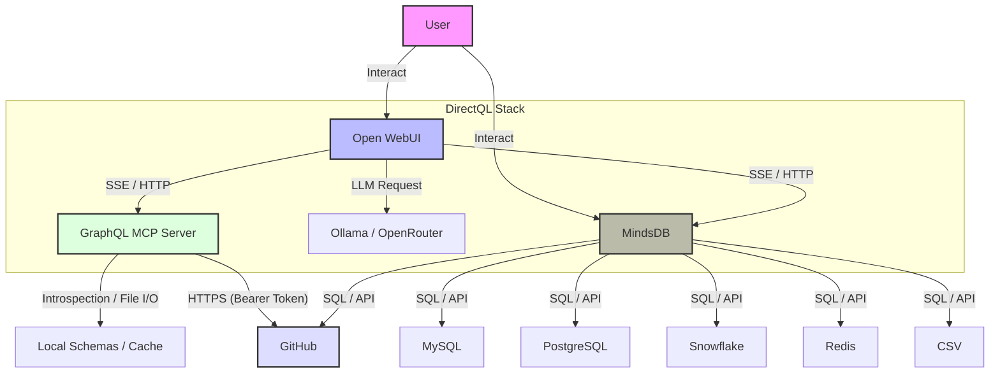
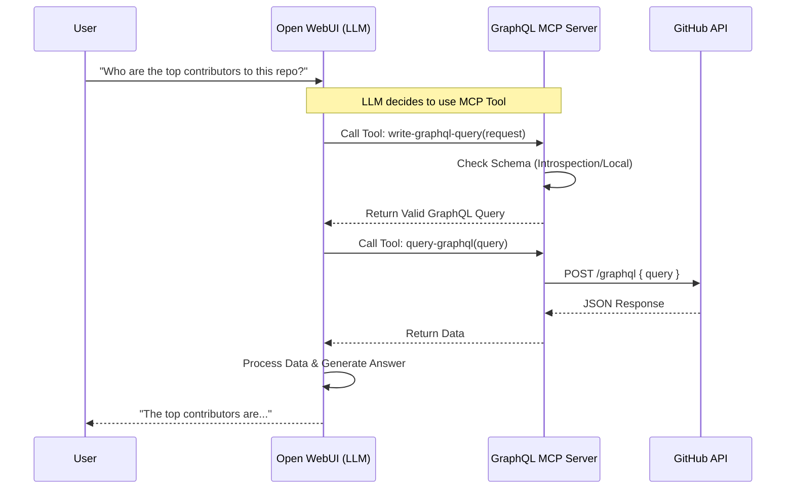

## DirectQL - Interactive Data AI Platform

Complete **AI stack** designed for local development, deployment, usage, of an interactive AI chat agent, that can access **GraphQL APIs and federated data sources** and communicates with natural language to make queries and retrieve information from endpoints, with focus on **GitHub GraphQL APIs**, **MindsDB** (configurable GraphQL/OpenAPI endpoints, DBs, MCP servers).


- **GraphQL MCP Server, Open WebUI, GitHub GraphQL API, Ollama, OpenRouter, MindsDB**
- Use case scenario 1: **direct user communication in natural language (and/or agentic AI), for federated graphql introspective schemas and endpoints** (optional local schema caching registration).
- Use case scenario 2: **direct user communication in natural language (and/or agentic AI), for federated data sources (eg: MySQL, PostgreSQL, Snowflake, Redis, csv, etc.)**

## Services
1. **graphql-mcp**: MCP server that exposes GraphQL APIs as a service for AI agents.
2. **open-webui**: The chat interface (ChatGPT clone).
3. **ollama**: (Optional) A local LLM runner.
4. **db-mcp**: MindsDB for data federation and data access via AI.

## System Architecture

## Key Features
-   **GraphQL MCP Server**: `graphql-mcp` with modular architecture.
-   **Smart Schema Caching**: Implements a 3-tier caching strategy (Memory -> Local Disk -> Remote Fetch) to minimize expensive introspection calls.
-   **OpenAI/OpenWebUI API Compatibility**: OpenWebUI is compatible with OpenAI API, allowing it to be used with any OpenAI-compatible client.
-   **MindsDB**: MindsDB with UI, that allows data federation and data access via AI.
-   **Helper Scripts**: `scripts/test-local-setup.sh`, `scripts/pull-ollama-model.sh`, `scripts/monitor-stack.sh` for local development and testing.
-   **Infrastructure**: infra scripts for deployments (Kubernetes,AWS,Railway)
-   **Testing**: automated end-to-end testing.
-   **Documentation**: Comprehensive documentation for setup, configuration, and usage.




## Workflow 1



---

### Configuration 1: The "Smart & Cheap"
*Uses OpenRouter (DeepSeek/Gemini/GPT) & Tools.*

### Components

1.  **DirectQL Client (Open WebUI)**
    -   The user interface for interacting with the AI.
    -   Connects to the GraphQL MCP Server via HTTP/SSE.

    **Service: open-webui**
    - `ROOT DIRECTORY`: `/open-webui`
    - Variables:
      - `OPENAI_API_BASE_URL`: `https://openrouter.ai/api/v1`
      - `OPENAI_API_KEY`: `sk-or-....` (Get from openrouter.ai)
      - `ENABLE_OPENAI_API`: `true`
      - `WEBUI_SECRET_KEY`: `(random string)`
      - `GRAPHQL_READ_ONLY`: `true`

2.  **GraphQL MCP Server** (`mcp/graphql-mcp/`)
    -   A Model Context Protocol (MCP) server that adapts GraphQL APIs for LLMs.
    -   **Features**:
        -   **Tools**: Execute queries (`query-graphql`) and introspect schemas (`introspect-graphql-schema`).
        -   **Resources**: Read schemas (`graphql://schema`, `graphql://local/...`).
        -   **Prompts**: Helper for writing queries (`write-graphql-query`).
    -   **Authentication**: Supports Bearer tokens and API Keys (x-api-key) for secure access to GraphQL endpoints (e.g., GitHub, Apollo Studio, etc).

    **Configuration**

    **Environment Variables**

      Create a `.env` file in the root:

      ```env
      # GraphQL MCP Server
      GRAPHQL_MCP_ENDPOINT=https://api.github.com/graphql
      GRAPHQL_API_KEY=your_github_token
      PORT=3000
      AUTH_TYPE=Bearer  # or x-api-key or none
      GRAPHQL_READ_ONLY=true # Enforce read-only queries
      ```


## MindsDB Integration (db-mcp)

The project includes **MindsDB** running as the `db-mcp` service, enabling you to federate data from multiple sources (PostgreSQL, MySQL, MongoDB, Redis, Snowflake, JIRA, CSV, GitHub, etc.) and query them using standard SQL.

### Access
- **GUI**: [http://localhost:47334](http://localhost:47334)
- **MCP Endpoint**: `http://localhost:47334/mcp/sse`

### connecting Data Sources
You can connect various data sources in the MindsDB GUI or API.

For configuration examples and usage instructions, please refer to [mcp/db-mcp/README.md](mcp/db-mcp/README.md).

*Optionally you can also add in the GUI the local ollama latest model for interacting with the DBs from the UI and optionally will have an option to be added as MCP to OpenWebUI DirectQL main UI.*

---

### Configuration 2: The "Fully Local"
*Uses Ollama running llama3.2:1b*

    **Service: ollama**
    - `ROOT DIRECTORY`: `/ollama`
    - Volume mount: `/root/.ollama`

    **Service: open-webui**
    - Variables:
    - `OLLAMA_BASE_URL`: `http://ollama-production:11434` (Replace with actual service name)
    - `ENABLE_OPENAI_API`: `false`

---

## Local Development & Helper Scripts

The project includes several helper scripts to verify the stack locally using Docker Compose.

#### 1. `./scripts/test-local-setup.sh`
**Usage**: `./scripts/test-local-setup.sh`
-   **Purpose**: Automated End-to-End (E2E) Setup & Test.
-   **Actions**:
    1.  Cleans up existing Docker containers.
    2.  Builds and starts the full stack (`graphql-mcp`, `ollama`, `open-webui`).
    3.  Waits for health checks.
    4.  Runs an E2E simulation script (`e2e_simulation.js`) against the local stack to verify connectivity and functionality.

> **Note:** This script does NOT download Ollama models automatically. Use `pull-ollama-model.sh` after the stack is running to download models.

#### 2. `./scripts/pull-ollama-model.sh`
**Usage**: `./scripts/pull-ollama-model.sh [model_name]`
-   **Purpose**: Manual Ollama model download.
-   **Actions**:
    1.  Checks if the Ollama container is running.
    2.  Downloads the specified model (default: `llama3.2:1b`).
-   **Examples**:
    ```bash
    # Download default model
    ./scripts/pull-ollama-model.sh
    
    # Download a specific model
    ./scripts/pull-ollama-model.sh llama3.2:3b
    ```

#### 3. `./scripts/monitor-stack.sh`
**Usage**: `./scripts/monitor-stack.sh`
-   **Purpose**: Real-time stack monitoring.
-   **Actions**:
    -   Displays running services and ports.
    -   Shows CPU/Memory usage stats.
    -   Scans recent logs for errors.
    -   Streams live logs from all containers.

### 4. `./mcp/graphql-mcp/cli.js`
**Usage**: `node mcp/graphql-mcp/cli.js`
-   **Purpose**: GraphQL MCP Server CLI - for proxying MCP to AI assistant.
-   **Configuration**: edit your AI assistant's configuration file to run the MCP server:
```
{
    "mcpServers": {
        "DirectQL": {
            "command": "node",
            "args": [
                "/DirectQL/graphql-mcp/cli.js"
            ],
            "cwd": "/DirectQL/graphql-mcp",
            "env": {
                "GRAPHQL_READ_ONLY": "true",
                "GRAPHQL_API_KEY": "your_github_token",
                "GRAPHQL_ENDPOINT": "https://api.github.com/graphql",
                "AUTH_TYPE": "Bearer"                
            }
        }
    }
}
```

---

## Testing

### MCP Protocol Test Suite
A comprehensive E2E test suite validates the full MCP protocol implementation (30 tests).  
**Requires a running stack** (`./scripts/test-local-setup.sh` first):

```bash
node mcp/graphql-mcp/test/e2e/mcp_protocol.js
```

### Other Tests
```bash
# Jest integration tests
cd mcp/graphql-mcp && npm test

# Security tests (read-only mode)
cd mcp/graphql-mcp && npm run test:security
```

The AI Agent can connect to the MCP Server using the following configuration:
1. Open your deployed WebUI (`https://webui-xyz.app`)
2. Go to **Admin Panel** > **Settings** > **Connections**
3. Add a new connection:
   - **Type**: MCP (SSE), not OpenAPI
   - **URL**: `https://graphql-mcp-xyz.app/sse`
   - **Headers**: `Authorization: Bearer <your-token> / None`

*Optionally you can also add in the GUI the local ollama latest model for interacting with it from the UI.*

---

## Running examples

### 1. Local setup and monitoring


### 2. Asking questions with MCP enabled on live deployment


### 3. Results received from live GitHub GraphQL API, via MCP, to AI Agent


### 4. MindsDB Interface


---
