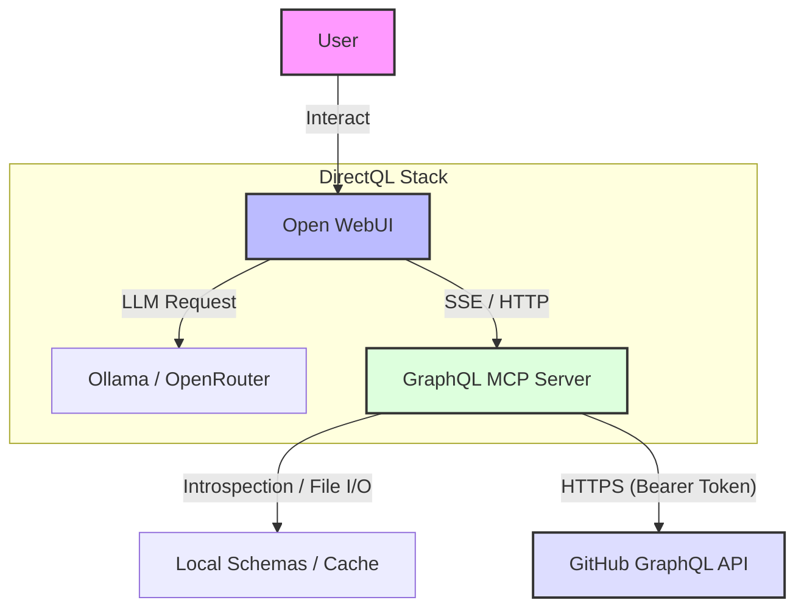

## DirectQL - Interactive AI Platform with GraphQL MCP Server

This repository contains a complete **AI agent stack** designed for local development and deployment, of an interactive AI chat agent, that can access GraphQL APIs and allows communication with natural language to make requests and get information from graphql endpoints, with particular focus of this version on **GitHub - GraphQL APIs**.


- **GraphQL MCP Server, Open WebUI, GitHub GraphQL API, Ollama, OpenRouter**
- Use case scenarios: **direct user communication and/or agentic AI, for federated graphql introspective schemas endpoints** (and optional local schema caching registration).


## Services
1. **graphql-mcp**: MCP server that exposes GraphQL APIs as a service for AI agents.
2. **open-webui**: The chat interface (ChatGPT clone).
3. **ollama**: (Optional) A local LLM runner.

## System Architecture

## Key Features
-   **Production-Ready MCP Server**: `graphql-mcp` with modular architecture.
-   **Smart Schema Caching**: Implements a 3-tier caching strategy (Memory -> Local Disk -> Remote Fetch) to minimize expensive introspection calls.
-   **Infrastructure**:
    -   **Kubernetes**: Sidecar-pattern manifests (`infra/kubernetes`) for scalable deployment.
    -   **AWS**: Terraform scripts (`infra/terraform`) for serverless ECS Fargate hosting.
    -   **Railway**: One-click PaaS configuration (`infra/railway`).
-   **Operational Maturity**: Docker Healthchecks, dependency ordering, and comprehensive integration tests.



## Workflow


---

### Configuration 1: The "Smart & Cheap" (Recommended)
*Uses OpenRouter (DeepSeek/Gemini/GPT) & Tools.*

## Components

1.  **DirectQL Client (Open WebUI)**
    -   The user interface for interacting with the AI.
    -   Connects to the GraphQL MCP Server via HTTP/SSE.

    **Service: open-webui**
    - `ROOT DIRECTORY`: `/open-webui`
    - Variables:
      - `OPENAI_API_BASE_URL`: `https://openrouter.ai/api/v1`
      - `OPENAI_API_KEY`: `sk-or-....` (Get from openrouter.ai)
      - `ENABLE_OPENAI_API`: `true`
      - `WEBUI_SECRET_KEY`: `(random string)`
      - `GRAPHQL_READ_ONLY`: `true`

2.  **GraphQL MCP Server** (`graphql-mcp/`)
    -   A Model Context Protocol (MCP) server that adapts GraphQL APIs for LLMs.
    -   **Features**:
        -   **Tools**: Execute queries (`query-graphql`) and introspect schemas (`introspect-graphql-schema`).
        -   **Resources**: Read schemas (`graphql://schema`, `graphql://local/...`).
        -   **Prompts**: Helper for writing queries (`write-graphql-query`).
    -   **Authentication**: Supports Bearer tokens and API Keys (x-api-key) for secure access to GraphQL endpoints (e.g., GitHub, Apollo Studio, etc).

### Configuration

  ### Environment Variables
      Create a `.env` file in the root:

      ```env
      # GraphQL MCP Server
      GRAPHQL_MCP_ENDPOINT=https://api.github.com/graphql
      GRAPHQL_API_KEY=your_github_token
      PORT=3000
      AUTH_TYPE=Bearer  # or x-api-key or none
      GRAPHQL_READ_ONLY=true # Enforce read-only queries
      ```
---

### Configuration 2: The "Fully Local"
*Uses Ollama running llama3.2:1b*

**Service: ollama**
- `ROOT DIRECTORY`: `/ollama`
- Volume mount: `/root/.ollama`

**Service: open-webui**
- Variables:
  - `OLLAMA_BASE_URL`: `http://ollama-production:11434` (Replace with actual service name)
  - `ENABLE_OPENAI_API`: `false`

---

## Local Development & Helper Scripts

The project includes several helper scripts to verify the stack locally using Docker Compose.

> **📖 Full Walkthrough**: See [docs/LOCAL_TESTING.md](docs/LOCAL_TESTING.md) for a complete step-by-step guide to test MCP + Ollama + Open WebUI locally.

### 1. `./scripts/test-local-setup.sh`
**Usage**: `./scripts/test-local-setup.sh`
-   **Purpose**: Automated End-to-End (E2E) Setup & Test.
-   **Actions**:
    1.  Cleans up existing Docker containers.
    2.  Builds and starts the full stack (`graphql-mcp`, `ollama`, `open-webui`).
    3.  Waits for health checks.
    4.  Runs an E2E simulation script (`e2e_simulation.js`) against the local stack to verify connectivity and functionality.

> **Note:** This script does NOT download Ollama models automatically. Use `pull-ollama-model.sh` after the stack is running to download models.

### 2. `./scripts/pull-ollama-model.sh`
**Usage**: `./scripts/pull-ollama-model.sh [model_name]`
-   **Purpose**: Manual Ollama model download.
-   **Actions**:
    1.  Checks if the Ollama container is running.
    2.  Downloads the specified model (default: `llama3.2:1b`).
-   **Examples**:
    ```bash
    # Download default model
    ./scripts/pull-ollama-model.sh
    
    # Download a specific model
    ./scripts/pull-ollama-model.sh llama3.2:3b
    ```

### 3. `./scripts/monitor-stack.sh`
**Usage**: `./scripts/monitor-stack.sh`
-   **Purpose**: Real-time stack monitoring.
-   **Actions**:
    -   Displays running services and ports.
    -   Shows CPU/Memory usage stats.
    -   Scans recent logs for errors.
    -   Streams live logs from all containers.

---

## Testing

### MCP Protocol Test Suite
A comprehensive E2E test suite validates the full MCP protocol implementation (30 tests).  
**Requires a running stack** (`./scripts/test-local-setup.sh` first):

```bash
node graphql-mcp/test/e2e/mcp_protocol.js
```

### Other Tests
```bash
# Jest integration tests
cd graphql-mcp && npm test

# Security tests (read-only mode)
cd graphql-mcp && npm run test:security
```

The AI Agent can connect to the MCP Server using the following configuration:
1. Open your deployed WebUI (`https://webui-xyz.app`)
2. Go to **Admin Panel** > **Settings** > **Connections**
3. Add a new connection:
   - **Type**: MCP (SSE), not OpenAPI
   - **URL**: `https://graphql-mcp-xyz.app/sse`
   - **Headers**: `Authorization: Bearer <your-token> / None`

---

## Running examples

### 1. Local setup and monitoring


### 2. Asking questions with MCP enabled on live deployment


### 3. Results received from live GitHub GraphQL API, via MCP, to AI Agent

